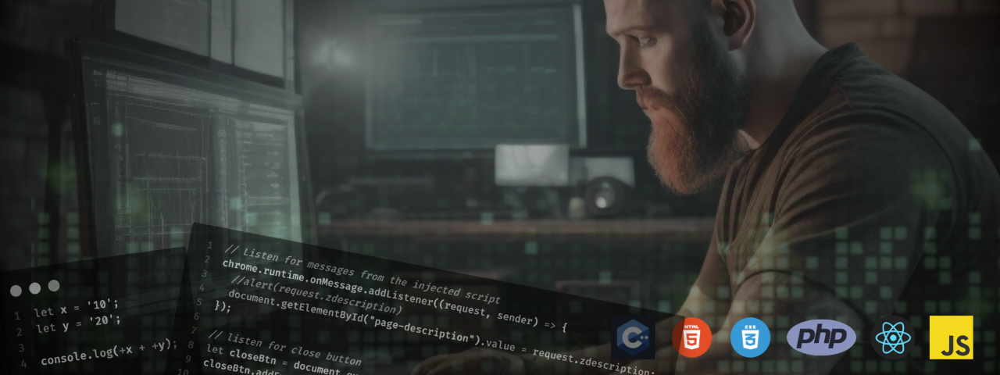

# 👋 Welcome to My GitHub Profile!

## About Me...

Hello!  I'm Ernie, a fullstack web & app developer and cybersecurity specialist with a focus on cross platform business applications for web, mobile and desktop systems.  I'm always open to new opportunities and collaborations, so feel free to get in touch if you have any questions or would like to discuss a project!

&nbsp;&nbsp;&nbsp;&nbsp;&nbsp;
## IT Related Experience...

- **2024 (August):** Teach groups and one-on-one with Python coding, home labs, and cybersecurity awareness for business. Configure and deploy VM server to allow students with under powered computers remote access to perform 'lab' work for projects on virtual machines (Windows & Linux systems).
- **2024 (January-)**: M365 Tenant setup and administration, cybersecurity incident response, PowerApp development, Sharepoint development.
- **2023**: HTML / CSS / JavaScript / PostgreSQL / Python & beyond
- **2012+**: Critical Infrastructure Protection
- **2010's**: HTML / Wordpress
- **2000's**: HTML / Perl / PHP / mySQL --> early days of e-commerce!
- **2000's**: C / C++ --> added Palm Pilot & 📟 Blackberry app development to the 'stack'.
- **1990's**: C / C++ --> Shareware & Commercial Application Developer (DOS/Windows), own & operate 3-line BBS (EPIC BBS), networking with LANtastic and Novell 10Base2 and multitasking DOS apps with DESQview!
- **1980's**: BASIC, Assembly --> Shareware Game Dev 🕹️ (Commodore & Tandy)

## Projects...  
Here are some recent projects I have worked on:
<table border=0>
<tr><td width=30%></td><Td><b>DFIRMadness - The Case of the Stolen Szechuan Sauce</b>
	 A cybersecurity forensics analysis and subsequent report on this cyber attack and subsequent breach which included a malware deployment resulting in data manipulation and exfiltration from a ficticious businesses.  Analysis PCAP (Wireshark captures), memory and drive dumps and more. 
	 
&nbsp;
</Td></tr>
<tr><td width=30%></td><Td><b>ErnieJohnson.ca - Personal Portfolio</b>
	 Develop and maintain a custom portfolio web site to showcase not only completed projects, but web development skills of the portfolio site itself. It utilizes HTML, CSS, React and ties with APIs written in both Python and PHP. 
	 

</Td></tr>	

<tr><td width=30%></td><Td><b>Company Kiosk</b>
	 
	Our client was looking for an internal kiosk type application to present upcoming events and information to both staff and visitors to the office on various screens throughout their business environment. The client was looking for a simple, yet effective solution that would be easy to maintain and update.  A modified version of this project code is now deployed in multiple companies in Canada and the USA. 
	 
<i>learned: remote management strategies, client/server updating, </i>
	 
&nbsp;
	
</Td></tr>

<tr><td width=30%></td><Td><b>Wordpress Base64 Attack & Remediation</b>
	 
	Client discovered their Wordpress feeder web sites were non-functional and shut down by hosting company due to excessive bandwidth utilization. After not being successful in contacting their existing web developer, I was contacted and after a short investigation discovered they were hit with a PHP Base64 redirect malware attack on their server.   Performed a brief analysis, developed some custom Python code to recurse their file system and clean infected files.  Remvoved numerous unused FTP accounts, reset all existing passwords, developed a password policy for the company. Put them on credential leak monitoring service I created.  Test and re-instate web sites. 
	 
	
</Td></tr>

<tr><td width=30%></td><Td><b>YourTab!</b>
	 
	This project stemmed off a freelance "new tab" page I had recently completed for a corporate client. I wanted to simply take that framework, add on a few features and make it publically usable. Besides, every developer project needs a to do list application in it - so why not put a to do list inside a more significant application!
	 
<i>learned: Chrome Extensions, HTML, CSS, jQuery</i>
	 
&nbsp;
	
</Td></tr>

<tr><td width=30%></td><Td><b>LearnThis!</b>
	 Keep your developer resource bookmarks all in one convenient location while having a quick organizational system and a built in "auto learning" algorithm to actually study from your saved materials in a logical, sorted method (derived from crowd-sourced data). 
<i>learned: React, Chrome Extensions, group project programming with tight deadlines</i>
	 

</Td></tr>

<!--
<tr><td></td><Td><B>MapMy-Wiki</B>
 MapMyWiki is geo-wiki type application created for LightHouseLabs.ca mid-term project to exercise our skills to date in the course including front and back end scripting in Javascript, Postgress SQL, HTML and CSS (via SASS). 
<i>learned: advanced JQuery, database design, Google Maps API (& API data caching to save costs & time)</i>
 

</Td></tr> -->
	
</table>

## IT Skills...  

- **Cybersecurity Frameworks**: ISO 27001, NIST, MITRE ATT&CK,
- **Cybersecurity Specialities**: Application Sececurity (AppSec) and Forensics & Incident Response (DFIR)
- **Programming Languages**: 💡 JavaScript, 🌐 HTML, 🎨 CSS, 💾 PHP, ⚙️ C, ⚙️ C++, 💎 Ruby, 🐪 Perl, 🐍 Python.
- **Frameworks/Libraries**: React, NodeJS, Express, Rails, JQuery, Boostrap, MaterialUI.
- **Databases**: 🗄️ MySQL, 🗄️ PostgreSQL, MongoDB.
- **Testing**: Jest, Mocha, Chai, Storybook, Cypress.
- **Code Editors**: ✒️ Sublime Text, ✒️ Visual Studio Code (VSCode).
- **Operating Systems**: Windows, MacOS, Linux, iOS, Android.

## What I'd Like to Work and Collaborate On...  

I'm looking to collaborate on the following types of projects:  

- 🚧 Construction industry related projects
- 🚔 Law Enforcement related projects
- 🗺️ Mapping related projects
- 💪 Health & Fitness related projects
- 🕹️ RPG style game development  

If you're working on any of these types of projects or have other exciting opportunities, feel free to reach out! I'm open to discussing new ideas and contributing to innovative projects.

<!--
## Contributions

I'm a strong believer in the open-source community and actively contribute to various projects. You can find my contributions on GitHub, and I welcome pull requests and collaboration on exciting projects.

## Blog

I occasionally share my thoughts, ideas, and coding tips on my personal blog. Check it out [here](link-to-your-blog) for some interesting articles!
--->
## Certifications...  
Completed:  
- [Lighthouse Labs: Cybersecurity Specialist](https://www.lighthouselabs.ca/en/cyber-security)
- [Google Cybersecurity Specialization](https://www.coursera.org/account/accomplishments/specialization/certificate/VDRRFKJ4ZAR8)
- [Lighthouse Labs: Data Analysist](https://www.lighthouselabs.ca/en/intro-to-data-analytics-course)
- [Lighthouse Labs: Full Stack Web Developer](https://www.lighthouselabs.ca/en/web-development)
  
In Progress:  
- Microsoft Cybersecurity Professional Certification
- Meta Front-End Developer Professional.
- Google UX Design Professional.
- Meta iOS Developer Professional.
<!---
 

--->

            
 <!---        

        
    <h3>My Workspace:</h3>
        
        
        
       
       
  

 ---> 
<!---
### Full Tech Stack:  ###
       

### Tech Libraries:  ###
        
--->

<!--- https://github.com/alexandresanlim/Badges4-README.md-Profile#-languages- --->

<!--
### Social (coming soon): ### 
      

---
-->

---

<!---
 

--->

	
  
&nbsp;⚡&nbsp;&nbsp;Github Stats...

   
  

  
  
  

	

	
  
&nbsp;☄️&nbsp;&nbsp;Github Streaks...

  

  
  

	

	
  
&nbsp;⚙️&nbsp;&nbsp;Things I use to get stuff done...

	 
  	<ul>
  	    <li><b>OS:</b> Ubuntu, Windows 11, MacOS</li>
	      <li><b>Laptop: </b> 16" Macbook Pro, Lenovo Thinkpad X1 Carbon, Lenovo Yoga 7i -- <a href="https://amzn.to/44xavQu">shop Canada</a> | <a href="https://amzn.to/3rC6UlL">shop USA</a></li>
		<li><b>Servers: </b> Synology NAS (~112TB), Custom Servers (x2) ~200TBea, one with near-bare-metal Linux VM desktop</li>
  	    <li><b>Browser: </b> Chrome, Firefox, Opera, Safari</li>
	      <li><b>Terminal: </b> Tabby with ZSH: Oh My Zsh</li>
	      <li><b>Code Editors:</b> VSCode, Sublime.</li>
	      <li><b>To Stay Updated:</b> Stackoverflow, Dev.to, Medium, Linkedin and Twitter.</li>
	</ul>
	

	
  
&nbsp;🐺&nbsp;&nbsp;Fun Facts...

   
	Although I enjoy exploring new technologies and finding creative ways to solve problems through application development, I also love 
	<ul><li>hiking ⛰,</li> 
	<li>photography📸,</li> 
	<li>scuba diving🤿,</li>
	<li>fitness💪,</li>
	<li>and being a "dog🐺 dad"!</li>
	</ul>

<!---  --->

<!--- 
other profile layouts of interest:
https://github.com/DenverCoder1/DenverCoder1/blob/main/README.md
https://github.com/DenverCoder1/readme-typing-svg
--->

<!---
badges for reference:
https://nitratine.net/blog/post/github-badges/
https://shields.io/

------
 

ej8899/ej8899 is a ✨ special ✨ repository because its `README.md` (this file) appears on your GitHub profile.
You can click the Preview link to take a look at your changes.
--->
